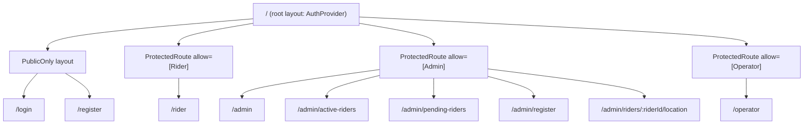
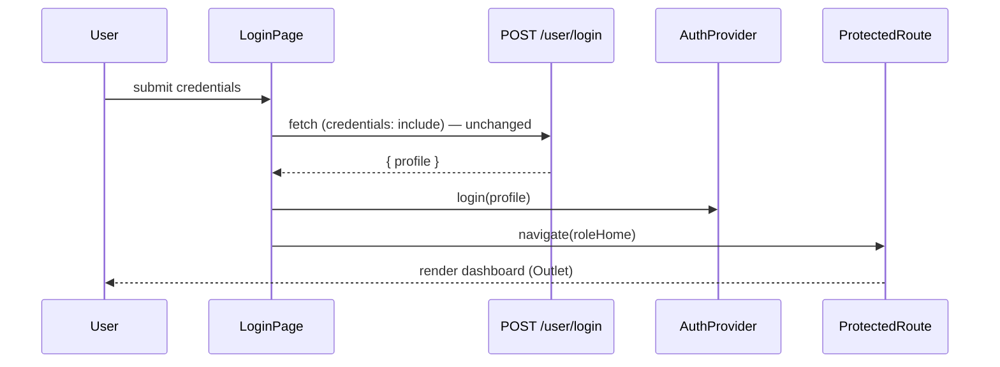

# ADR-0002: Routing & Auth (react-router 7 library mode + AuthProvider)

## Status
Proposed (routing/auth approach pre-agreed; this ADR fixes the concrete design)

## Context
Navigation today is `useState<Page>` with a 9-value string union and an if-chain in `App.tsx`; the `Profile` object is prop-drilled. react-router 7 is already installed but unused. Roles: Rider, Admin, Operator (Customer reserved). Backend API is WIP elsewhere — login/register fetch calls must stay byte-compatible (`POST /user/login`, `POST /register/user`, `credentials: "include"`).

## Options Considered
1. **Library mode: `createBrowserRouter` + data router, guards as layout routes** ✅
   - Pros: URL-addressable views, browser back/refresh work, role guards centralized, zero framework buy-in, no SSR.
   - Cons: `App.tsx` must be split; deep-link refresh needs auth persistence (deferred — see below).
2. **Framework mode (file-based routes / SSR)** — rejected: overkill for a 6-view SPA, adds build complexity, violates simplicity default.
3. **Keep string-switch, just extract it** — rejected: no URLs, no history, guards stay ad-hoc; blocks MSW-era testing and future backend integration.

## Decision — Route Tree

| Path | Element | Guard | Maps to old `Page` |
|------|---------|-------|--------------------|
| `/login` | `LoginPage` | `PublicOnly` (redirect if authed) | `login` |
| `/register` | `RegisterPage` | `PublicOnly` | `register` |
| `/rider` | `RiderDashboard` | role: Rider | `rider-dashboard` |
| `/admin` | `AdminDashboard` | role: Admin | `admin-dashboard` |
| `/admin/register` | `RegisterPage` (`showRole` variant) | role: Admin | `admin-register` |
| `/admin/active-riders` | `ActiveRiders` | role: Admin | `active-riders` |
| `/admin/pending-riders` | `PendingRiders` | role: Admin | `pending-riders` |
| `/admin/riders/:riderId/location` | `RiderLocationView` | role: Admin | `rider-location` (old `params` → route param + `location.state`) |
| `/operator` | `OperatorDashboard` | role: Operator | `operator-dashboard` |
| `/` | index redirect | → role home or `/login` | — |
| `*` | redirect to `/` | — | — |

## Decision — AuthProvider

- `src/features/auth/AuthProvider.tsx`: React context holding `{ profile: Profile | null, login(profile), logout() }`.
- **In-memory only** this iteration (matches current behavior: refresh = logged out). Session persistence (`sessionStorage` rehydrate) → deferred register.
- `LoginPage` keeps the existing fetch verbatim; on success calls `auth.login(data.profile)` then `navigate(roleHome(profile.role))` — replicating today's role → dashboard switch.
- `logout()` clears profile; guards then bounce to `/login` (replaces `setPage("login")`).
- Rendered as the root layout route's element wrapping `<Outlet/>`, so every route can `useAuth()` — ends prop-drilling of `profile`/`onLogout` (props kept where pages already accept them; wiring happens in route elements to avoid touching page internals).

## Decision — Guard Pattern & Redirects

`ProtectedRoute` = layout route component:

| Condition | Behavior |
|-----------|----------|
| No profile | `<Navigate to="/login" replace state={{ from: location }} />` |
| Role not in `allow` | `<Navigate to={roleHome(profile.role)} replace />` (no 403 page — simplicity) |
| Authed user hits `/login` or `/register` | `PublicOnly` redirects to `roleHome(role)` |
| Post-login | Navigate to `state.from ?? roleHome(role)` |

`roleHome`: Rider→`/rider`, Admin→`/admin`, Operator→`/operator` (case-insensitive match, mirroring today's `toLowerCase()` checks). Unknown role → `/login` + `logout()`.

## Decision — Where types live
- `Profile` + `Role`/`ROLES` → `src/types/profile.ts` (shared by auth feature, dashboards, and MSW handlers — hoisting avoids feature-to-feature imports per ADR-0001).
- Route path constants → `src/router.tsx` (single consumer; extract to `lib/routes.ts` only if a second consumer appears).

## Consequences
- Positive: real URLs/history; role access declared once; `App.tsx` retired; MSW + future e2e tests can target routes.
- Negative: refresh on a protected deep link logs out until persistence lands (same net behavior as today, now more visible).
- Neutral: `NavigateParams`-style data for RiderLocationView moves to route param + `location.state`.

## Open questions / Risks
- Open: Customer role destination; backend session semantics (cookie from `credentials:include`) may later enable a `/me` rehydrate endpoint.
- Risk: guard case-sensitivity on `role` strings from the real backend — mirror existing `toLowerCase()` logic exactly.

## References
ADR-0001 (structure), ADR-0003 (MSW), react-router 7 library-mode docs
