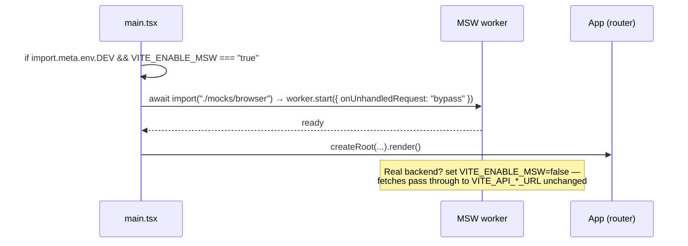

# ADR-0003: Mock API via MSW 2.x

## Status
Accepted (2026-07-29, at end of Checkpoint 7)

## Context
Login/register call a WIP backend (`VITE_API_LOGIN_URL` / `VITE_API_REGISTER_URL`, defaulting to `http://localhost:3000/user/login` and `/register/user`, `credentials: "include"`). Frontend devs need to work without the backend running, **without changing app fetch code**, and the contract must stay compatible for the real backend swap-in.

## Options Considered
1. **MSW 2.x browser worker (service-worker interception)** ✅
   - Pros: intercepts real `fetch` at network level — app code untouched; same handlers reusable in Node (`msw/node`) for future tests; dev-only, tree-shaken out of prod; zero cost.
   - Cons: `public/mockServiceWorker.js` generated artifact must be committed; worker registration is async (must gate first render).
2. **Vite dev-server proxy + tiny Express/json-server stub** — rejected: second process to run, drifts from contract, no test reuse.
3. **`if (mock)` branches in app code** — rejected: violates "app fetch code stays unchanged", pollutes prod paths.

## Decision — Layout & Wiring

```text
src/mocks/
  browser.ts          # setupWorker(...handlers)
  handlers/
    index.ts          # export const handlers = [...auth]  (spread per-domain arrays)
    auth.ts           # POST /user/login, POST /register/user
    riders.ts         # POST /GetAll/UnregisteredRiders (added 2026-07-29 merge)
  data/
    riders.ts         # seed arrays moved from src/app/data/mockData.ts (ADR-0001 #6)
public/mockServiceWorker.js   # generated: npx msw init public/ — committed
```

- Handlers are grouped **per backend domain** (`auth.ts` now; `riders.ts` later when rider endpoints exist), mirroring real API surface, seeded from the `mockData.ts` shapes and typed with `src/types/{profile,rider}.ts`.
- Handler URLs are built from the same `src/lib/config.ts` constants the app uses, so mock and app can never disagree on endpoints.

### Contract fidelity (must match backend WIP exactly)

| Endpoint | Request | Success response | Notes |
|----------|---------|------------------|-------|
| `POST /user/login` | `{ phone, password }` ¹ (+ cookie via `credentials:include`) | `{ role, profile: { name, role, ... } }` | role drives redirect (ADR-0002) |
| `POST /register/user` | `{ name, email, phoneNumber, dob, address, password, role }` ³ | success payload → app navigates to login | field names frozen |
| `POST /GetAll/UnregisteredRiders` ² | *(empty body; cookie via `credentials:include`)* | `{ riders: Array<{ name, phone, activation_status, area? }> }` — dashboards filter `activation_status === "pending"` case-insensitively | Added 2026-07-29 during origin/main merge; env var `VITE_API_GET_All_UNREGISTERED_URL` name preserved verbatim from collaborator commit 3f197d2. PendingRiders itself still consumes local mocks — see Deferred D18. |

Seed users: one per role (Rider/Admin/Operator/Customer) defined in `handlers/auth.ts`; wrong phone or password → 401 with the error shape the UI already renders.

¹ **Amended 2026-07-29 (QA F6):** ADR-0003's original draft listed `{ email, password }` but `LoginPage.tsx` submits `{ phone, password }` (verbatim from pre-C5 App.tsx, with a `/^\d{10}$/` client-side check). Source of truth = `src/features/auth/pages/LoginPage.tsx`. Handlers now match on phone.

³ **Amended 2026-07-30 (Iter 4 §2, product decision 1):** the `dob` VALUE is now canonicalized to **ISO `YYYY-MM-DD`** in the register payload (e.g. `"1995-12-25"`). The UI still displays and accepts `DD/MM/YYYY` in `#reg-dob`; `RegisterPage.handleSubmit` converts the display form to ISO immediately before `fetch`. Field names and payload shape remain byte-identical — only the `dob` string format is fixed. MSW seeds already use ISO (`1998-03-15` etc.) so no seed changes needed. If the backend contract diverges (accepts `DD/MM/YYYY` instead), this row supersedes the frontend behavior — file a follow-up ADR amendment.

## Decision — Enable/Disable Switch

Single flag: **`VITE_ENABLE_MSW`** (in `.env.example`, default `true` for local dev, absent/`false` in CI build and when pointing at a real backend).



- `import.meta.env.DEV` guard + dynamic `import()` ⇒ MSW is **excluded from production bundles** even if the flag is misconfigured.
- `onUnhandledRequest: "bypass"` ⇒ map tiles / Google Maps / fonts flow through untouched.
- Render is awaited behind `worker.start()` to avoid a first-fetch race.

## Consequences
- Positive: frontend fully usable offline/backend-less; contract documented as executable handlers; handlers reusable for future vitest/Playwright (deferred).
- Negative: committed generated worker file (~10 KB) must be regenerated on major MSW upgrades; devs must toggle the flag when integrating against the real backend.
- Neutral: `msw` added as a devDependency (zero prod cost) — consistent with frugality constraint.

## Assumptions / Open questions / Risks
- Assumption: login success shape is `{ profile: {...} }` as consumed by current `LoginView` — verify against backend WIP before freezing handlers.
- Open: does backend set an auth cookie MSW should simulate? (Current app never reads it — safe to skip.)
- Risk: contract drift once backend evolves — mitigate by treating `handlers/` as the living contract, updated in the same PR as any backend change announcement.

## References
ADR-0001 (mocks/ location), ADR-0002 (auth flow), MSW 2.x docs (browser integration)
