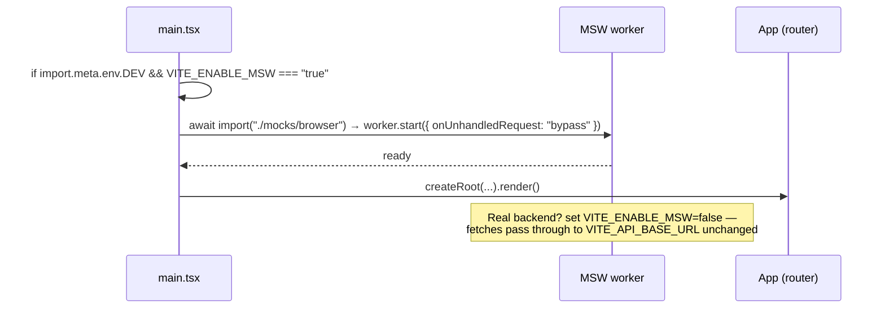

# ADR-0003: Mock API via MSW 2.x

## Status
Accepted (2026-07-29, at end of Checkpoint 7)

## Context
Login/register call a WIP backend at `${VITE_API_BASE_URL}/user/login` and `${VITE_API_BASE_URL}/register/user` (both with `credentials: "include"`). Frontend devs need to work without the backend running, **without changing app fetch code**, and the contract must stay compatible for the real backend swap-in. **Amended 2026-07-31 (env phase 1):** per-endpoint env variables (`VITE_API_LOGIN_URL`, `VITE_API_REGISTER_URL`, `VITE_API_GET_All_UNREGISTERED_URL`, `VITE_API_GET_ALL_RIDERS_URL`) were consolidated into a single `VITE_API_BASE_URL`. Endpoint PATHS are hard-coded in `src/api/<feature>.ts` alongside the fetch call sites; the base URL is the only per-environment knob. **Amended 2026-07-31 (env phase 2):** `src/lib/config.ts` was removed; endpoint paths and composed URL constants now live per feature in `src/api/auth.ts` (`/user/login`, `/register/user`) and `src/api/riders.ts` (`/GetAll/UnregisteredRiders`, `/GetAll/Riders`). MSW handlers import the URL constants from the same feature modules the pages call; the pages themselves never call `fetch` directly — they go through the `src/api/client.ts` wrapper, which throws a typed `ApiError` carrying the verbatim server response text on failure. A fail-fast validator (`src/lib/env.ts`, invoked from `main.tsx` before any other module) renders a standalone error screen when either `VITE_API_BASE_URL` or `VITE_ENABLE_MSW` is missing/empty/invalid — there are no silent localhost fallbacks.

## Options Considered
1. **MSW 2.x browser worker (service-worker interception)** ✅
   - Pros: intercepts real `fetch` at network level — app code untouched; same handlers reusable in Node (`msw/node`) for future tests; dev-only, tree-shaken out of prod; zero cost.
   - Cons: `public/mockServiceWorker.js` generated artifact must be committed; worker registration is async (must gate first render).
2. **Vite dev-server proxy + tiny Express/json-server stub** — rejected: second process to run, drifts from contract, no test reuse.
3. **`if (mock)` branches in app code** — rejected: violates "app fetch code stays unchanged", pollutes prod paths.

## Decision — Layout & Wiring

```text
src/mocks/
  browser.ts          # setupWorker(...handlers)
  handlers/
    index.ts          # export const handlers = [...auth]  (spread per-domain arrays)
    auth.ts           # POST /user/login, POST /register/user
    riders.ts         # POST /GetAll/UnregisteredRiders (added 2026-07-29 merge)
  data/
    riders.ts         # seed arrays moved from src/app/data/mockData.ts (ADR-0001 #6)
public/mockServiceWorker.js   # generated: npx msw init public/ — committed
```

- Handlers are grouped **per backend domain** (`auth.ts` now; `riders.ts` later when rider endpoints exist), mirroring real API surface, seeded from the `mockData.ts` shapes and typed with `src/types/{profile,rider}.ts`.
- Handler URLs are built from the same `src/api/<feature>.ts` constants the app uses, so mock and app can never disagree on endpoints.

### Contract fidelity (must match backend WIP exactly)

**Amended 2026-08-04 (backend contract v2 — see `docs/design/API-Document.pdf`):** all portal-consumed endpoints renamed to kebab-case resources. The old `/user/login`, `/register/user`, `/GetAll/UnregisteredRiders`, `/GetAll/Riders` names are RETIRED — the frozen URL constants in `src/api/{auth,riders}.ts` are the source of truth. Rider list responses now use an envelope `{riders: [{role, profile: {...}}]}` — the api-client layer (`src/api/riders.ts`) flattens `.profile` and maps `dateOfJoining → joinedAt` so downstream mappers/pages read the same flat shape as before. Login response `role` is lowercase (`"rider"`, `"customer"`, …); `src/api/auth.ts` title-cases it at the boundary so the rest of the app keeps capitalized role literals.

**Amended 2026-08-04 (v3 — audit follow-ups):** three additive changes shipped in one batch after `docs/qa/api-audit.md`: (a) `activate-rider` NOW CONSUMED via `activateRider(phone, pin)` in `src/api/riders.ts`; PendingRiders' RiderProfileCard exposes an "Activate rider" button (enabled only when `form.pin` matches `/^\\d{6}$/`). (b) `update-user` NOW CONSUMED via `updateUser(phone, role, patch)`; PendingRiders' `handleSave` now computes a diff vs the currently-loaded rider and POSTs only changed fields. (c) `email` on `/register-user` is now OPTIONAL — `RegisterPayload.email?: string`, submit omits the field when empty, label suffixed with `(optional)` / `(اختیاری)`. MSW handlers in `src/mocks/handlers/riders.ts` gained mutating `/activate-rider` and `/update-user` handlers so seed changes persist for the session in dev.

| Endpoint | Request | Success response | Notes |
|----------|---------|------------------|-------|
| `POST /user-login` ⁶ ⁹ | `{ phone, password }` ¹ (+ cookie via `credentials:include`) | `{ userId, profile: { role: <lowercase>, name, phone, area, address, rideState, dateOfJoining, dob, activationStatus, totalRides, totalDistance, missedRides, online, currentLocation: {lat,lon}, rating, lastCustomerID } }` | Role drives redirect (ADR-0002). Case normalized to Title Case in `src/api/auth.ts` before app sees it. **No top-level `role`** — `profile.role` is authoritative; the top-level fallback in `login()` exists only as legacy safety. `userId` shape is `USER#<phone>`. |
| `POST /register-user` ⁶ | `{ name, email? ⁷, phone, dob, address, password, role }` ³ ⁴ | 200 `{ message, userId }`; 4xx `{ message }` on validation error | Field names frozen. **`email` is optional as of v3 (2026-08-04)** — omitted from body when empty; format-validated only when non-empty. Success payload → app navigates to login; `RegisterPage` does not inspect the response body. |
| `POST /update-user` ⁸ | `{ phone, role, ...fieldsToPatch }` | `{ message, updatedFields }`; 4xx `{ message }` on missing identifier | **Consumers as of v3 (2026-08-04):** PendingRiders + BlockedRiders "Save changes" both wire through `updateUser(phone, role, diff)`. Diff excludes `id` + `phone` (phone is the identifier); `cnic` is compared after `normalizeCnicInput()` on both sides so display-form differences (dashed vs raw 13-digit) do not create false-positive diffs. Empty diff → no API call, still shows saved-notice. |
| `POST /get-all-inactive-riders` ² ⁶ | *(empty body; cookie via `credentials:include`)* | `{ riders: [{ role, profile: { name, phone, area, address, rideState, dateOfJoining, dob, activationStatus, totalRides, totalDistance, missedRides, online, currentLocation: {lat,lon}, rating, lastCustomerID, ...} }] }` | The api-client flattens each `.profile` into the row and remaps `dateOfJoining → joinedAt` so `toPendingRider()` and dashboards keep reading a flat object. Status resolution rule unchanged: non-empty `activation_status\|activationStatus` wins case-insensitively; else `activated === true` → active; else pending. `cnic`, `documents`, `pin`, `id` are not returned by the backend contract — mapper synthesises `id = idx + 1` and falls back to empty strings/arrays. |
| `POST /get-all-riders` ⁵ ⁶ | *(empty body; cookie via `credentials:include`)* | `{ riders: [{ role, profile: { ...same profile shape as get-all-inactive-riders, activationStatus ∈ "active"\|"pending"\|"blocked"\|"offboarded" } }] }` | Same flattening + status rules as the sibling endpoint. `joinedAt` derived from `dateOfJoining` in the api-client layer. |
| `POST /activate-rider` ⁸ | `{ phone, pin }` (pin = 6 digits) | `{ success: true, message, updatedFields: { activation_status: "active" } }`; error `{ success: false, error }` | **Consumer as of v3 (2026-08-04):** RiderProfileCard's "Activate rider" button (visible only when `onActivate` prop passed + `pin` is 6 digits). On success PendingRiders removes rider from list. Response `activation_status` is **snake_case** (per PDF); type kept as `updatedFields?: { activation_status?: string }` at the boundary — no downstream mapper touches it. |

Seed users: one per role (Rider/Admin/Operator/Customer) defined in `handlers/auth.ts`; wrong phone or password → 401 with the error shape the UI already renders.

¹ **Amended 2026-07-29 (QA F6):** ADR-0003's original draft listed `{ email, password }` but `LoginPage.tsx` submits `{ phone, password }` (verbatim from pre-C5 App.tsx, with a `/^\d{10}$/` client-side check). Source of truth = `src/features/auth/pages/LoginPage.tsx`. Handlers now match on phone.

³ **Amended 2026-07-30 (Iter 4 §2, product decision 1):** the `dob` VALUE is now canonicalized to **ISO `YYYY-MM-DD`** in the register payload (e.g. `"1995-12-25"`). The UI still displays and accepts `DD/MM/YYYY` in `#reg-dob`; `RegisterPage.handleSubmit` converts the display form to ISO immediately before `fetch`. Field names and payload shape remain byte-identical — only the `dob` string format is fixed. MSW seeds already use ISO (`1998-03-15` etc.) so no seed changes needed. If the backend contract diverges (accepts `DD/MM/YYYY` instead), this row supersedes the frontend behavior — file a follow-up ADR amendment.

⁴ **Amended 2026-07-30 (backend collaborator contract change):** the register field previously named `phoneNumber` is renamed to `phone`. Register body is now `{ name, email, phone, dob, address, password, role }` (still exactly 7 keys). Login already used `phone`; `/GetAll/UnregisteredRiders` already emits `phone` — the frontend now speaks `phone` consistently across all three endpoints. `RegisterPage.tsx`, `handlers/auth.ts` `RegisterBody`, and `tests/regression/contract.test.ts` frozen-key-set updated atomically. H1 in `AGENTS.md` updated in the same change.


⁵ **Added 2026-07-31 (ADR-0004):** proposed unified rider endpoint. Response shape is a superset of `/GetAll/UnregisteredRiders`: it adds `cnic` (required), `joinedAt` (required ISO date), and widens the `activation_status` enum from `"pending"|"active"` to include `"blocked"` and `"offboarded"`. Alias rules for `area`/`rideArea` and `activated`/`activation_status` are IDENTICAL to the sibling endpoint (`src/features/riders/mapper.ts` documents the resolution). Awaiting backend confirmation — MSW handler is the living contract until then.

⁶ **Amended 2026-08-04 (backend contract v2):** resource paths kebab-cased — `/user/login`→`/user-login`, `/register/user`→`/register-user`, `/GetAll/UnregisteredRiders`→`/get-all-inactive-riders`, `/GetAll/Riders`→`/get-all-riders`. Rider responses adopt the `{role, profile:{...}}` envelope; the api-client flattens `.profile` on the way through so mapper/pages/tests keep the flat-row assumption. Login response `role` is lowercase per the doc; `src/api/auth.ts` normalises to Title Case at the boundary in ONE place — guards (`ProtectedRoute`, `roleHome`) already tolerate either case, and H2/H3 tripwires (Customer seed unknown-role logout, ROLES never widened) verified.

⁷ **`email` field NOT in the v2 doc.** As of v3 (2026-08-04) portal marks `email` optional: the register form still displays the field (labelled "Email address (optional)") but omits it from the payload when empty. Format validation still runs on non-empty values. Backend behavior for the field remains unspecified — accepted-and-ignored is the working assumption.

⁸ **Added 2026-08-04 (v3 — audit follow-ups):** consumers wired for `update-user` and `activate-rider` per `docs/qa/api-audit.md` gap findings. Both endpoints mutate MSW seeds in-place so a subsequent `get-all-riders`/`get-all-inactive-riders` reflects the change during the same dev session. Owner-approved implementation, no separate ADR required — this row of ADR-0003 is the living contract per H6.

⁹ **Amended 2026-08-04 (v4 — login response real-backend alignment):** login response reshaped to mirror the actual backend contract confirmed by owner: **no top-level `role`**; instead top-level `userId` (`USER#<phone>`) alongside `profile`. `profile` now carries lowercase `role` + full real-backend fieldset (`phone`, `rideState`, `activationStatus`, `totalDistance`, `lastCustomerID` with capital ID). Phantom fields `ratings`, `distanceTraveled`, `lastCustomerId` (lowercase id) REMOVED from seed + response — they never existed on the real backend. `RiderDashboard.tsx` bindings corrected: `profile?.ratings → profile?.rating`, `profile?.distanceTraveled → profile?.totalDistance`. `src/types/profile.ts` Profile type additively covers real fields; deprecated aliases removed. `src/api/auth.ts` `login()` normaliser unchanged — already prefers `profile.role` over top-level `role`, so top-level absence is safe. Contract regression test updated to assert `{ userId, profile.role }` shape.

## Decision — Enable/Disable Switch

Single flag: **`VITE_ENABLE_MSW`** (in `.env.example`, default `true` for local dev, absent/`false` in CI build and when pointing at a real backend).



- `import.meta.env.DEV` guard + dynamic `import()` ⇒ MSW is **excluded from production bundles** even if the flag is misconfigured.
- `onUnhandledRequest: "bypass"` ⇒ map tiles / Google Maps / fonts flow through untouched.
- Render is awaited behind `worker.start()` to avoid a first-fetch race.

## Consequences
- Positive: frontend fully usable offline/backend-less; contract documented as executable handlers; handlers reusable for future vitest/Playwright (deferred).
- Negative: committed generated worker file (~10 KB) must be regenerated on major MSW upgrades; devs must toggle the flag when integrating against the real backend.
- Neutral: `msw` added as a devDependency (zero prod cost) — consistent with frugality constraint.

## Assumptions / Open questions / Risks
- Assumption: login success shape is `{ profile: {...} }` as consumed by current `LoginView` — verify against backend WIP before freezing handlers.
- Open: does backend set an auth cookie MSW should simulate? (Current app never reads it — safe to skip.)
- Risk: contract drift once backend evolves — mitigate by treating `handlers/` as the living contract, updated in the same PR as any backend change announcement.

## References
ADR-0001 (mocks/ location), ADR-0002 (auth flow), MSW 2.x docs (browser integration)
