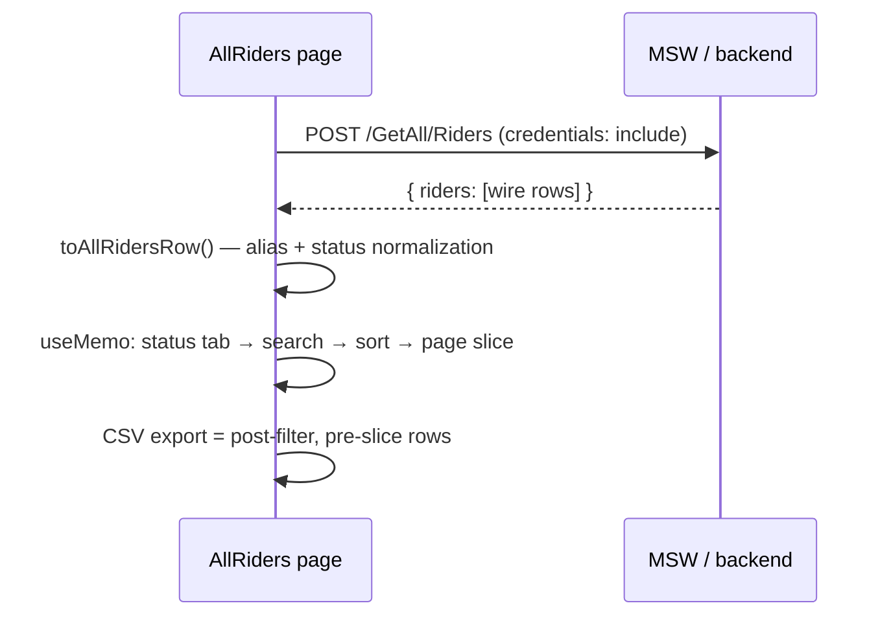

# ADR-0004: All Riders Admin Data Table

## Status
Proposed (2026-07-31)

## Context
UX spec `docs/ux/riders-table-spec.md` (approved) defines an admin "All Riders" table: 7 columns,
status tabs (all/active/pending/blocked/offboarded), 300ms-debounced search, 3-state single-column
sort, pagination 10/25/50/100, CSV/XLSX export of the filtered view. MVP is client-side data
(<500 riders at DBX8 scale). Bundle baseline is **223.43 kB gzip, single chunk, guard band
219.0–227.9 enforced by tests** (~4.5 kB headroom). Backend currently exposes only
`POST /GetAll/UnregisteredRiders` (ADR-0003). Team is 8 people, frugality-first.

## Decision 1 — Table engine: **hand-rolled** (not TanStack Table v8)
Options: (a) TanStack Table v8 (~12 kB gzip) vs (b) hand-rolled sort/filter/paginate over a client array.
**Chosen: (b) hand-rolled.**
- ~12 kB TanStack cost alone blows the 4.5 kB band headroom → forces a band bump for zero user-visible gain.
- MVP scope (single-column sort, one text filter, one enum filter, page slicing) is ~150 LOC of `useMemo` chains — well inside team competence; no learning curve.
- TanStack earns its keep at column visibility/pinning/row-selection/virtualization — all Fast-follow/Later in the UX spec, none MVP.
- Hand-rolled keeps rendering on the existing shadcn `<Table>` primitives exactly as the spec requires; the a11y contract (aria-sort, focus rules) is ours to implement either way.
- Escape hatch: if the Fast-follow tier (column visibility + row selection) lands, revisit TanStack in a follow-up ADR with a deliberate band bump — the spec column model maps 1:1 to TanStack `ColumnDef`, so migration is cheap.

## Decision 2 — Export: hand-rolled CSV now, XLSX deferred (**D23**)
- MVP: CSV via a ~30-LOC hand-rolled serializer (RFC-4180 quoting: wrap fields containing comma/quote/newline, double inner quotes). No `xlsx` (~90 kB) / `csv-stringify` dep — rejected: band-breaking or unnecessary.
- **Scope: exports the CURRENTLY filtered/searched view** (UX spec §3.6); button label shows count ("Export 8 riders"). Columns = all visible except Actions; status as plain label.
- Filename: **`rydee-riders-{statusTab}-{YYYY-MM-DD}.csv`** (`{statusTab}` = active tab value incl. `all`; local date). E.g. `rydee-riders-blocked-2026-07-31.csv`.
- XLSX omitted from the MVP menu; register **D23: "XLSX export for All Riders table (client-side lib ~90 kB gzip — needs D22-style chunk or band decision)"** in the deferred-work register.

## Decision 3 — Data contract: new proposed endpoint **`POST /GetAll/Riders`**
Options: (a) reuse `POST /GetAll/UnregisteredRiders` vs (b) propose `POST /GetAll/Riders`.
**Chosen: (b).** The existing endpoint contractually implies the unregistered/pending subset and
cannot express `blocked`/`offboarded`; overloading it risks breaking PendingRiders (H1/D18).
- Mock in MSW **now** (`src/mocks/handlers/riders.ts`, seeds incl. 2–3 blocked + offboarded); propose to the backend collaborator as the server-ready contract. Additive → H1-safe.
- URL from `src/lib/config.ts` as `API_GET_ALL_RIDERS_URL` (env `VITE_API_GET_ALL_RIDERS_URL`, default `http://localhost:3000/GetAll/Riders`); request: empty body + `credentials: "include"` (matches sibling endpoint).
- Response shape (wire):

```json
{ "riders": [ {
  "id": 1, "name": "…", "phone": "03001234567", "cnic": "42101-1234567-1",
  "activation_status": "active | pending | blocked | offboarded",
  "activated": true, "area": "DHA", "rideArea": "DHA", "joinedAt": "2026-05-01"
} ] }
```

- **Wire aliases honored exactly per ADR-0003**: field is `phone` (never `phoneNumber`); `area` may arrive as `rideArea` (`raw.area ?? raw.rideArea`); status resolution: non-empty `activation_status` (case-insensitive) **wins**; else `activated === true` → `active`, otherwise `pending`. Unknown status strings normalize to `pending` + console.warn.
- Frontend normalizes at the boundary (`toAllRidersRow()`) into the spec §7.1 `AllRidersRow` type with `RiderStatus = "active" | "pending" | "blocked" | "offboarded"`. `joinedAt` is required of the real backend; the mock synthesizes it (spec §10.3).
- **ADR-0003 contract table MUST be updated in the same commit** that adds the handler (H6 / living-contract rule).

## Decision 4 — Route, guard, nav: **`/admin/all-riders`**, static import
- Path `admin/all-riders`, added to the existing **`ProtectedRoute allow={["Admin","Operator"]}` rider-management group** in `router.tsx` — same group as active/pending riders per ADR-0002 (QA-F3 Option A); the UX spec header note `allow={["Operator"]}` is superseded by this ADR. Additive only; no `roleHome()`/guard edits (H8).
- Route element exported from `src/features/riders/routes.tsx` (`AllRidersRoute`), page at `src/features/riders/AllRiders.tsx` — matches ADR-0001 layout.
- Nav hook: the **Total Riders StatCard** on `AdminDashboard` gains `onClick={() => navigate("/admin/all-riders")}` + hint "View all riders →" (UX spec §5). No new nav items.
- **Static import, not `React.lazy`**: owner dropped lazy loading in commit 0f79f7e (split premium exceeded value at ~224 kB) and D22 sets the revisit trigger at ~300 kB. Hand-rolled engine + CSV (~3–5 kB est.) should fit the band; if the band test fails, first choice is a small justified band bump in the same commit — a lazy-route ADR only at the D22 threshold.

## Decision 5 — Pagination: **client-side** MVP
Fetch all riders once, slice in memory (10/25/50/100, default 10, per UX spec §3.7). Server-side
pagination/filtering is explicit future work — trigger: rider count > ~1000 or payload > ~500 kB;
requires a paged `POST /GetAll/Riders` variant (`{ page, pageSize, status?, q? }`) and a new ADR.

## Data flow



## Consequences
- Positive: zero new dependencies; band likely holds; contract is additive and server-ready; MSW stays the living contract.
- Negative: hand-rolled engine is bespoke code to test (sort cycle, filter combos — QA gate); TanStack migration deferred, not avoided, if Fast-follow lands.
- Neutral: D23 (XLSX) and server-side pagination consciously parked with named triggers.

## Open questions / risks
- Backend must confirm `POST /GetAll/Riders` + `joinedAt` + unified status enum — until then MSW-only (risk: drift; mitigation: ADR-0003 same-commit sync rule).
- Band risk: if hand-rolled + page code exceeds 227.9 kB, bump the band in the same commit with attribution (never silently widen tests).
- Actions-column content (spec §10.2) unresolved — MVP ships View-only or empty; not blocking this ADR.

## References
UX spec `docs/ux/riders-table-spec.md` · ADR-0001/0002/0003 · `docs/design/migration-plan.md` (D18 done, D22, new D23) · commit 0f79f7e (lazy-loading drop)